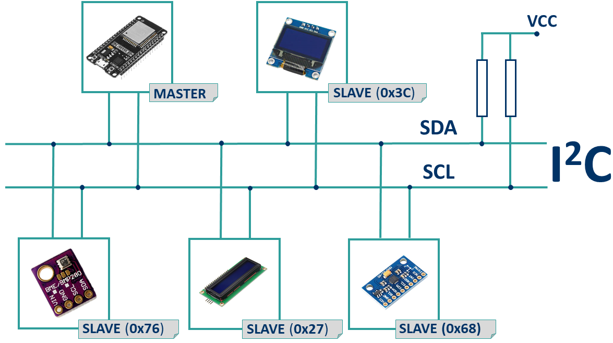

# ESP32 I2C Communication

The ESP32 has two I2C bus interfaces that can serve as I2C master or slave.

## Connecting I2C Devices with ESP32

The ESP32 supports I2C communication through its two I2C bus interfaces that 
can serve as I2C master or slave, depending on the user’s configuration. 

Accordingly to the ESP32 datasheet, the I2C interfaces of the ESP32 supports:

* Standard mode (100 Kbit/s) 
* Fast mode (400 Kbit/s) 
* Up to 5 MHz, yet constrained by SDA pull-up strength 
* 7-bit/10-bit addressing mode 
* Dual addressing mode. Users can program command registers to control I²C interfaces, 
    so that they have more flexibility.

I2C communication protocol uses two wires to share information. 
One is used for the **clock signal (SCL)** and the other is used to **send and receive data (SDA)**.

The SDA and SCL lines are **active low**, so they should be pulled up with resistors. 
Typical values are **4.7k Ohm for 5V** devices and **2.4k Ohm for 3.3V** devices.

Most sensors we use in our projects are breakout boards that already have the resistors built-in. 

Connecting an I2C device to an ESP32 is normally as simple as connecting:
* GND to GND
* **SDA (default is GPIO 21)** to SDA of the device
* **SCL (default is GPIO 22)** to SCL of the device 
* positive power supply to a peripheral, usually 3.3V



When using the ESP32 with Arduino framework, the default I2C pins are GPIO 22 (SCL) 
and GPIO 21 (SDA) but we can configure your code to use any other pins.


## Wire Library
This library allows you to communicate with I2C devices. 

The Wire library implementation uses a 32 byte buffer, therefore any communication should be within this limit. Exceeding bytes in a single transmission will just be dropped.

To use this library, we include the `Wire.h` header file:
```C
#include <Wire.h>
```

The following methods are provided by the `Wire` class:

* **void Wire.begin()**\
    Initializes the `Wire` library and join the I2C bus as a **Master**. 
    This function should normally be called only once.
* **void Wire.begin(uint8_t address)**\
    If the Arduino join the bus as a **Slave**, a 7-bit address is specified.

* **void Wire.end()**\
    Disable the `Wire` library, reversing the effect of `Wire.begin()`.


* **uint8_t Wire.requestFrom(uint8_t address, uint8_t quantity)**\
    This function is used by the controller device (Master) to request bytes from a peripheral device (Slave).
    The 7-bit slave address of the device to request bytes from is the first parameter, 
    the number of bytes to request is the second one.

    It returns the number of bytes returned from the peripheral device.

* **void Wire.beginTransmission(uint8_t address)**\
    Begins a transmission to the I2C peripheral device (Slave) with the given address. 
    The parameter `address` is the 7-bit address of the device to transmit to.

* **uint8_t Wire.endTransmission(void)**\
    After `beginTransmission()`, the library queues bytes for transmission with the `write()` function and transmit them by calling `endTransmission()`.

* **size_t Wire.write(uint8_t value)**\
   **size_t write(const uint8_t *data, size_t len)**\
   **size_t Wire.write(String value)**\

    Writes data from a peripheral device (Slave) in response to a request from a controller device (Master), 
    or queues bytes for transmission from a controller (Master) to peripheral device (Master) - in-between calls to `beginTransmission()` and `endTransmission()`.

    Returns the number of bytes written.

* Wire.read()

* Wire.available()

* Wire.setClock()

* Wire.onReceive()

* Wire.onRequest()

* Wire.setWireTimeout()

* Wire.clearWireTimeoutFlag()

* Wire.getWireTimeoutFlag()


## Scan I2C Address

With I2C communication, each slave on the bus has its own address, a hexadecimal number that allows the ESP32 to communicate with each device.

The I2C address can be usually found on the component’s datasheet. However, if it is difficult to find out, you may need to run an I2C scanner sketch to find out the I2C address.


## Use Different I2C Pins 

With the ESP32 we can set almost any pin to have I2C capabilities, we just need to set 
that in your code.

When using the ESP32 with the Arduino Framework, we use the `Wire.h` library to communicate 
with devices using I2C. With this library, you initialize the I2C as follows:

```C
    Wire.begin(I2C_SDA, I2C_SCL);
```

We just need to set our desired SDA and SCL GPIOs on the `I2C_SDA` and `I2C_SCL` variables.


## Multiple I2C Devices

Each I2C device has its own address, so it is possible to have multiple I2C devices on the same bus.


## Using an I2C Multiplexer

Sometimes it is not trivial changing the I2C address. So, in order to have multiple 
devices with the same address in the same I2C bus, we can use an I2C multiplexer like 
the **TCA9548A** that allows you to communicate with up to 8 devices with the same address.


## Using Two I2C Bus Interfaces

To use the two I2C bus interfaces of the ESP32, you need to create two `TwoWire` instances.
```C
TwoWire I2Cone = TwoWire(0);
TwoWire I2Ctwo = TwoWire(1);
```

Then, initialize I2C communication on your desired pins with a defined frequency.
```C
void setup() 
{
  I2Cone.begin(SDA_1, SCL_1, freq1);
  I2Ctwo.begin(SDA_2, SCL_2, freq2); 
}
```

Then, we can use the methods from the `Wire.h` library to interact with the I2C 
bus interfaces.


## References
* [ESP32 I2C Communication: Set Pins, Multiple Bus Interfaces and Peripherals (Arduino IDE)](https://randomnerdtutorials.com/esp32-i2c-communication-arduino-ide/)

* [Arduino: Wire Library](https://www.arduino.cc/reference/en/language/functions/communication/wire/)

*Egon Teiniker, 2023, GPL v3.0* 