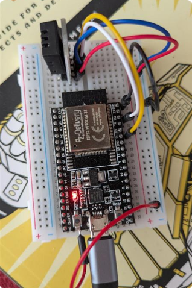

# ESP32 with DHT20 Using MQTT 

Our sensor **DHT20** uses **I²C communication**. Thus, the wires you see connected are clearly:

| Wire Color | ESP32 Pin | DHT20 Pin  | Meaning (I²C Interface)            |
|------------|-----------|------------|------------------------------------|
| **Red**    | 3V3       | VCC        | Power Supply (3.3V)                |
| **Black**  | GND       | GND        | Ground Reference                   |
| **White**  | GPIO21    | SDA        | Serial Data Line (I²C Data)        |
| **Yellow** | GPIO22    | SCL        | Serial Clock Line (I²C Clock)      |

About the I²C Communication Protocol:
- **SDA (Serial Data Line)**: Used to transmit and receive data between ESP32 and the sensor.
- **SCL (Serial Clock Line)**: Provides the clock signal, synchronizing communication between ESP32 and the sensor.

Pins used for I²C on ESP32:
- **GPIO21** typically acts as **SDA**
- **GPIO22** typically acts as **SCL**

Our setup implements **I²C communication** to interface your **ESP32** with a 
**DHT20 sensor**, leveraging pins **GPIO21 (SDA)** and **GPIO22 (SCL)** for 
data communication.
